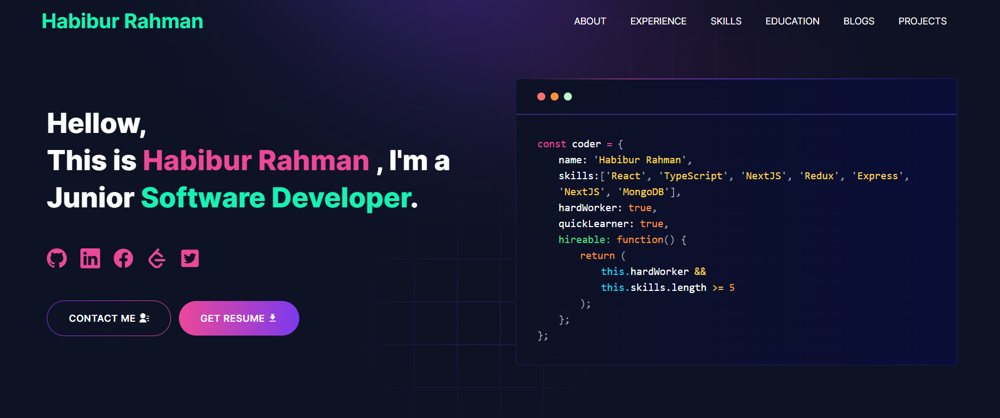

# My Developer Portfolio built with next.js(14)

###### previous portfolio [here](https://habiburdev.netlify.app/)

---

# Demo :movie_camera:



## View live preview [here](https://habibur18.vercel.app/).

---

## Table of Contents :scroll:

- [Sections](#sections-bookmark)
- [Demo](#demo-movie_camera)
- [Installation](#installation-arrow_down)
- [Getting Started](#getting-started-dart)
- [Usage](#usage-joystick)
- [Packages Used](#packages-used-package)

---

# Sections :bookmark:

- HERO SECTION
- ABOUT ME
- EXPERIENCE
- SKILLS
- PROJECTS
- EDUCATION
- CONTACTS

---

# Installation :arrow_down:

### You will need to download Git and Node to run this project

- [Git](https://git-scm.com/downloads)
- [Node](https://nodejs.org/en/download/)

#### Make sure you have the latest version of both Git and Node on your computer.

```
node --version
git --version
```

## <br />

# Getting Started :dart:

### Fork and Clone the repo

To Fork the repo click on the fork button at the top right of the page. Once the repo is forked open your terminal and perform the following commands

```
git clone https://github.com/<YOUR GITHUB USERNAME>/Nextjs-14-Portfolio.git
cd developer-portfolio
```

### Install packages from the root directory

```bash
npm install
# or
yarn install
```

Then, run the development server:

```bash
npm run dev
# or
yarn dev
```

Open [http://localhost:3000](http://localhost:3000) with your browser to see the result.

---

# Usage :joystick:

Goto [resend.com/](https://resend.com/) and create a new account for the mail sending. In free trial you will get 100 mail per Day. After setup `resend` account, Please create a new `.env` file from `.env.example` file.

Eg:

```env
RESEND_API_KEY= Your Secret API Key
```

---

# Packages Used :package:

| Used Package List  |
| :----------------: | --- |
|        next        |     |
|    lottie-react    |
| react-fast-marquee |
|    react-icons     |
|   react-toastify   |     |
|    tailwindcss     |

---
